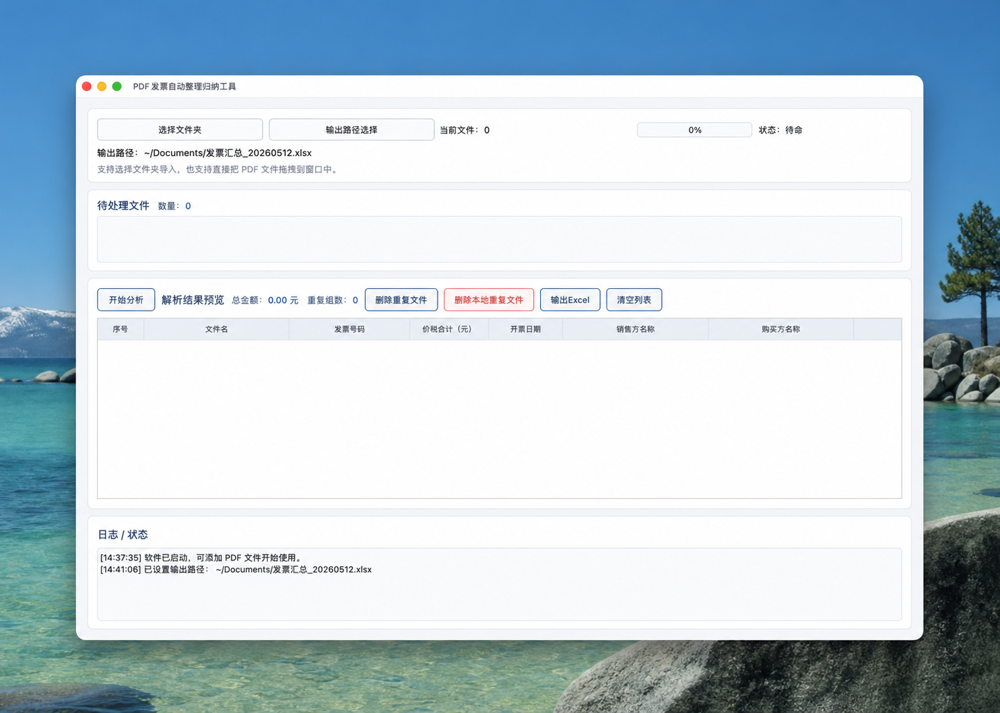

# PDF 发票自动整理归纳工具

一个基于 Python + Qt 的本地桌面工具，用于批量导入 PDF 发票、解析关键信息、在界面中预览结果，并导出 Excel。


这个仓库保留源码、配置、打包脚本和文档，不提交本地虚拟环境、构建目录、`.app`、`.exe`、压缩包等产物。

## 适用场景

- 批量整理 PDF 发票并提取关键信息
- 本地离线处理，不依赖在线上传
- 导出 Excel 供报销、对账或归档使用

## 快速开始

```bash
python3 -m venv .venv
source .venv/bin/activate
pip install -r source/requirements.txt
python main.py
```

## 界面截图



这张图是本机实际运行时的窗口截屏，用来展示当前界面布局和信息层级。

## 功能概览

- 批量导入 PDF 发票
- 支持拖拽 PDF 到窗口
- 导入时校验 PDF 后缀、文件大小和 PDF 文件头，跳过异常文件
- 优先直接提取 PDF 文本，必要时自动 OCR 兜底，默认最多 OCR 前 10 页
- 在 GUI 中预览解析结果、状态、失败/复核原因、总金额和重复组数
- 支持按全部、失败、需复核、重复筛选结果，并用颜色高亮问题行
- 支持双击结果行查看发票详情、OCR 信息和原文预览
- 支持金额、日期、发票号码等关键字段校验
- 支持重复文件识别、重复发票号码标记；同票号但金额/日期/销售方不一致会标为高风险冲突
- 支持从结果中移除重复项；也可在二次确认后将本地重复文件移到系统回收站/废纸篓
- 支持按“全部记录 / 建议记录 / 失败需复核清单”导出 `.xlsx`
- 导出的 Excel 自动包含“问题汇总”工作表
- 导出前会提示已有文件覆盖风险；覆盖时会先备份原 Excel
- 支持在界面设置 OCR 是否启用、分析前是否确认、最大 OCR 页数和低置信度阈值
- 预留模板导出能力

> 当前版本重点是“识别 + 预览 + Excel 汇总”。PDF 原文件的自动重命名、复制归档目录、归档后删除原文件等流程尚未作为默认功能开放；如需启用这类高风险操作，建议先做“预览重命名结果 → 冲突检测 → 复制校验 → 再人工确认”的安全流程。

## 仓库结构

```text
pdf_invoice_organizer/
├── app/
│   ├── mac/
│   ├── mac_intel/
│   └── windows/
├── release/
│   └── mac/
│       ├── apple_silicon/
│       └── intel/
├── runtime/
│   └── README.md
├── source/
│   ├── app.py
│   ├── assets/
│   ├── config/
│   ├── exporters/
│   ├── models/
│   ├── parsers/
│   ├── services/
│   ├── ui/
│   └── utils/
├── tools/
│   ├── build_mac_intel.command
│   ├── build_windows.bat
│   ├── invoice_organizer.spec
│   ├── invoice_organizer_windows.spec
│   └── start_invoice_app.bat
├── build_mac_intel.command
├── build_windows.bat
├── main.py
├── start_invoice_app.bat
└── start_invoice_app.command
```

## 环境要求

- Python 3.9+
- macOS 或 Windows
- 推荐使用虚拟环境

核心依赖见 [source/requirements.txt](source/requirements.txt)。

## 本地开发启动

1. 创建虚拟环境

```bash
python3 -m venv .venv
source .venv/bin/activate
```

2. 安装依赖

```bash
pip install -r source/requirements.txt
```

3. 启动程序

```bash
python main.py
```

## 测试

```bash
python -m compileall main.py source tests
python -m unittest discover -s tests
```

当前测试覆盖了解析器、批处理去重、Excel 导出、配置读写、PDF 文件校验和文本提取 fallback。真实 OCR 与完整打包验证仍建议作为手动或发布前检查。

## 运行方式说明

这个项目有两种常见运行方式：

- 源码运行：在项目目录中安装依赖后，直接执行 `python main.py`
- 打包运行：运行打包脚本后，使用生成的 `.app`、`.exe` 或发布压缩包

如果你看到的是开发阶段窗口截图，那也可能来自源码运行版本，而不一定是已经打包完成的安装包。

## 打包说明

### macOS Apple Silicon

在 Apple Silicon Mac 上执行：

```bash
python -m PyInstaller tools/invoice_organizer.spec --noconfirm --distpath app/mac --workpath build/mac
```

### macOS Intel

在 Intel Mac 上执行：

```bash
./build_mac_intel.command
```

会生成：

```text
app/mac_intel/PDF发票自动整理归纳工具.app
release/mac/intel/PDF发票自动整理归纳工具_mac_intel_YYYYMMDD_HHMMSS.zip
```

### Windows

在 Windows 环境中执行：

```text
build_windows.bat
```

会生成：

```text
app/windows/PDF发票自动整理归纳工具/
```

注意：Windows 当前是 `one-dir` 打包，发布时需要连同 `_internal` 目录一起分发，不能只发 `.exe`。

## 运行数据位置

项目目录内不保存用户运行数据。

macOS：
- 配置：`~/Library/Application Support/PDF发票自动整理归纳工具/`
- 日志：`~/Library/Logs/PDF发票自动整理归纳工具/`

Windows：
- 配置：`%APPDATA%\PDF发票自动整理归纳工具\`
- 日志：`%LOCALAPPDATA%\PDF发票自动整理归纳工具\logs\`

详细说明见 [runtime/README.md](runtime/README.md)。

## 主要入口

- 根入口：[main.py](main.py)
- 应用启动逻辑：[source/app.py](source/app.py)
- 主窗口：[source/ui/main_window.py](source/ui/main_window.py)
- 解析服务：[source/services/invoice_service.py](source/services/invoice_service.py)
- Excel 导出：[source/exporters/excel_exporter.py](source/exporters/excel_exporter.py)

## 分层约定

- `ui`：只负责交互、提示和界面刷新。
- `services`：编排导入、识别、去重、文件发现等流程。
- `parsers`：只做文本提取和字段解析，不依赖界面。
- `exporters`：只负责输出文件，并处理导出安全细节。
- `utils`：无业务状态的通用工具。

运行期未使用本地数据库；识别结果主要保存在内存中，用户主动导出时写入 Excel。日志和配置写入系统用户目录，项目目录内不保存用户运行数据。

## GitHub 发布建议

- 提交源码、文档、配置样例和打包脚本
- 不提交 `.venv`、`.venv_intel`、`.venv_windows`
- 不提交 `build/`、`.app`、`.exe`、压缩包、日志、`__pycache__`
- 用 GitHub Release 分发各平台打包产物，而不是直接放进仓库
